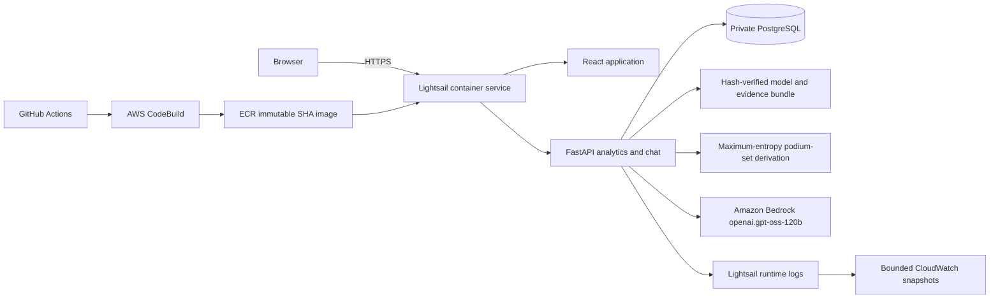

# System architecture

## Product boundary

F1 Race Strategist is a historical Formula 1 intelligence product for the supplied 1950–2024 archive. The same React/FastAPI image serves the public interface and API from AWS Lightsail. The application database is private PostgreSQL, and the runtime role is limited to `SELECT`. Podium probabilities are produced by the frozen local model for 2022–2024 races. Bedrock interprets chat questions and plans statistics queries; it does not invent result values or generate podium probabilities.

## Agentic question flow

1. The API preserves the original question and applies conservative database-derived spelling correction.
2. Query augmentation adds at most four labeled variants: original, corrected, relevant prior-turn context and selected race.
3. The entity retriever ranks stored drivers, constructors and circuits. Exact full names outrank references and components; shared surnames require clarification. Explicit full-name evidence suppresses overlapping token-only and reference-only noise.
4. The schema retriever ranks the 14 known tables and closes required join paths from committed relationship metadata. At most seven tables are sent normally; an all-schema fallback remains available for genuinely broad questions.
5. Bedrock classifies the request. Unsupported weather, tyres, telemetry, betting, live/future results and database mutations are refused. Ambiguous identities return suggestions without a provider call or SQL execution when detected deterministically.
6. Statistics receive one SQL plan. SQLGlot validation allows one read-only statement over known tables/functions, adds result limits and rejects mutations or raw-detail abuse. PostgreSQL then enforces the same boundary with a separate `SELECT`-only role and statement timeout.
7. A rejected plan can receive exactly one repair using a coarse `validation_rejected` or `execution_rejected` category. A request cannot exceed three provider calls.
8. Answers render from executed rows. Prediction and explanation routes call the frozen model directly and show actual driver probabilities and SHAP log-odds contributions.

The frontend sends no more than three compact turns containing only question, intent, selected entity identifiers/names and race ID. It excludes answers, SQL, rows, provider metadata and the access code. The visible trace is also allowlisted: interpreted question, route, canonical entities, selected tables, attempt outcomes, repair count, model-call count and timing.

## Data and model flow

The ingestion pipeline audits the supplied CSV hashes and loads 701,433 rows across 14 relational tables transactionally. The same feature code serves training and inference. Chronological splits are fit 2010–2018, selection 2019–2021 and final test 2022–2024; same-date outcomes are unavailable until every row for that date is emitted. The final model and calibration were frozen before the final test evaluation.

The calibrated classifier first emits raw marginal podium probabilities. A deterministic clipped-logit offset then projects all entrants in one race onto an expected count of exactly three without changing their order. The same offset is added to the SHAP base value, preserving exact explanation reconstruction. Raw and projected values remain available in the API for auditability.

`models/manifest.json` binds the model, grid baseline, evaluation reports, calibration, features, split, and postprocessor to SHA-256 hashes. The runtime verifies this manifest before deserializing joblib artifacts. `/api/health/ready` checks the database, bundle, and public model card; `/api/model-card` returns a bounded allowlisted evidence view. `/api/predictions/{race_id}/review` generates the forecast before reading same-race results, then returns predicted/recorded podiums and whole-grid scoring.

`GET /api/predictions/{race_id}/podium-outcomes` enumerates every unordered three-driver subset of the supported race field. It solves the exponential-family maximum-entropy distribution whose reconstructed driver marginals match the released forecast. One parameter is fixed for identifiability; SciPy least squares uses the exact covariance Jacobian, and the service fails closed unless convergence, total mass, marginal count, and maximum reconstruction error all satisfy the contract. The strict response returns at most 25 ranked sets, bounded co-podium pairs, complete-distribution diagnostics, canonical driver IDs, and an explicit evidence boundary. It uses no result labels and fits no new model. The complete distribution is coherent for unordered podium membership under the maximum-entropy assumption, but it does not model position order or learned driver interactions.

`POST /api/predictions/{race_id}/scenario` accepts only two distinct starters, copies the race frame, exchanges their `grid_position` inputs, and returns the released and counterfactual forecasts through a strict finite response model. Actual grid positions are returned separately from transformed model inputs, including the fixed `25` proxy for a recorded pit-lane grid of `0`. The endpoint cannot accept arbitrary features or mutate storage. Mutation and copy-isolation tests prove that same-race labels, future results, outcome derivation, and scenario execution cannot change the released forecast. See `docs/evaluation.md` and `EXPERIMENTS.md` for metrics and limitations.

## Release and operations

GitHub Actions runs Ruff, Python tests, frontend lint/format/tests/build, high-severity npm audit, pinned-runtime pip audit, and Terraform validation. Monthly Dependabot checks Python, npm, and GitHub Actions dependencies with a small open-PR limit. The guarded release uploads a clean Git archive plus trusted local model artifacts, and CodeBuild builds and pushes an ECR image tagged with the full Git SHA. The Lightsail release refuses an absent image or dirty working tree. Production startup rejects writable database credentials.

Every response receives a generated request ID and browser security headers. Health, chat, and scenario POST responses are never cached; historical and derived GET APIs use a five-minute cache; fingerprinted static assets are immutable for one year; SPA shells revalidate. Large responses use gzip. Prediction, podium-outcome, scenario, and review completion logs contain only the request ID, race ID, model version, operation kind, elapsed time, bounded counts, probability sum, reconstruction error, or hit count. The append-only `scripts.verify_public_release` command challenges request-ID reflection and verifies these delivery rules plus the SPA, archive, readiness, released model, maximum-entropy outcome reconstruction, bounded grid scenario, review, and model-card contracts from the public origin. Its optional single typo-correction chat probe writes only allowlisted counts and status fields.

The verified Podium Outcome application release is Git SHA `74e60f2dcb74e2cab956321f0b1212f3cccfaeb1`, CodeBuild `f1-race-strategist-dev:502ca3f9-8a94-478c-a0b0-6901d5e6b786`, ECR digest `sha256:5efd1bf5722b1a6172b4855f05429ec5c04030b5376e4a61f3e46c42ab6e7109`, and Lightsail deployment 18 in `eu-north-1`. Deployment 18 contains only the application container and preserves the private PostgreSQL 16.15 database and `SELECT`-only runtime boundary. Continuous stdout/stderr remains in Lightsail. The operator export bounds the active deployment window, follows every returned page up to a safety limit, and writes a chronological snapshot to the 14-day CloudWatch group `/f1/dev/api`. Verified stream `lightsail/20260911T235935380383Z` contains prediction, podium-outcome, scenario, review, and chat completion records. All five event types matched their field allowlists; configured protected values, credential names, question text, SQL, outcome identities, and outcome URLs were absent from readback. The public `reports/podium_outcome_aws_release_v18.json` and combined `reports/podium_outcome_cloud_verification.json` bind these checks to the deployed SHA; earlier release reports remain unchanged as historical evidence.

## Deliberate limits

The archive has no dependable weather, tyre, fuel or telemetry data and ends in 2024. The race-level projection constrains marginal probabilities. The outcome map supplies one maximum-entropy joint distribution over unordered podium membership; it does not supply an ordered finish, learned dependence structure, causal interaction, or new validation evidence. Grid scenarios are counterfactual model sensitivity checks and do not establish causal track effects or new validation evidence. The public demo uses an access code and per-process rate/concurrency limits rather than individual accounts. The quota resets when a container restarts. The small service and database have no multi-region failover, durable distributed quota or notification subscriber. See `docs/deployment.md` for rollback, retained AWS resources and costs.
